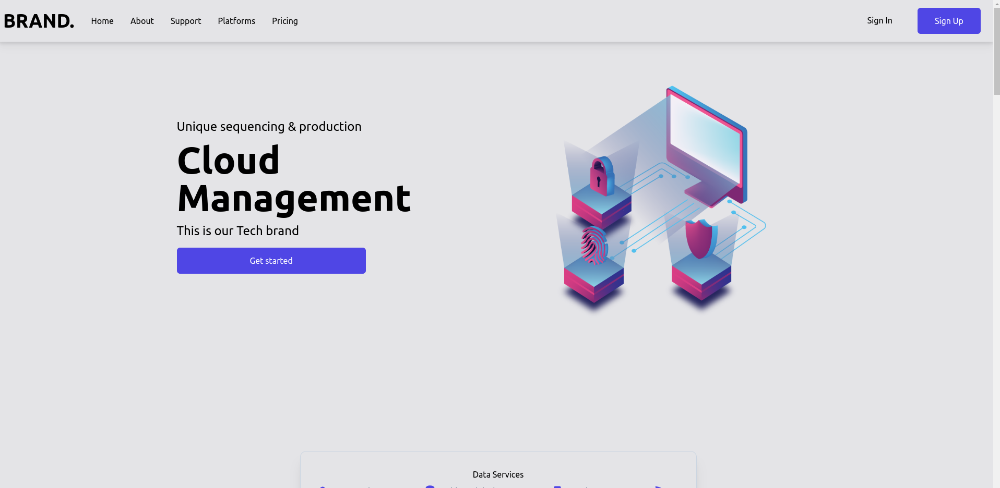
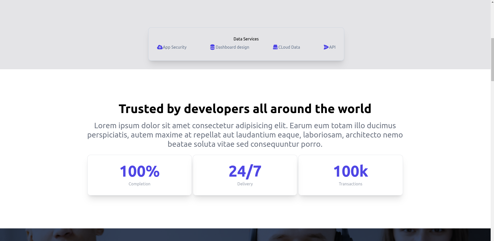
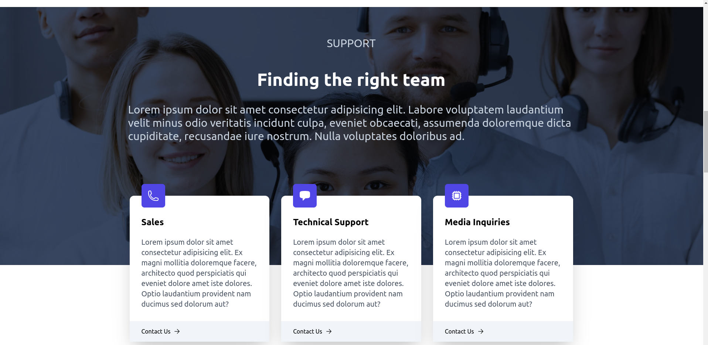
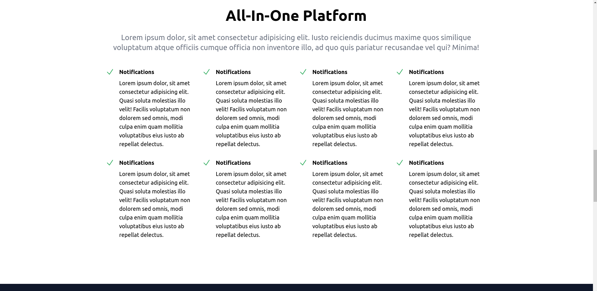
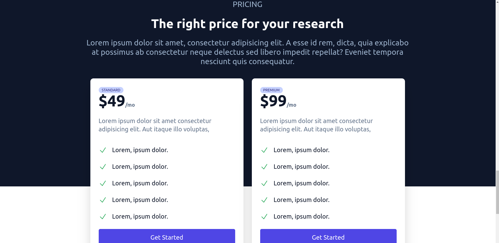
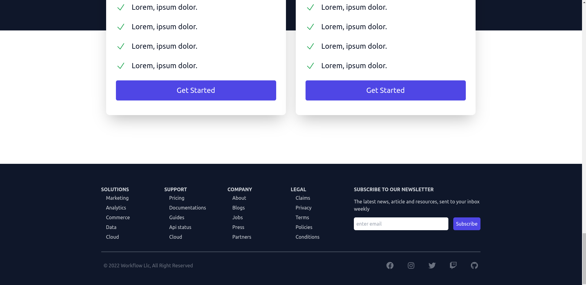

# Tailwind-cloud-management-landing-page

This is a vpn website template developed with tailwind css


To install and run the application, please follow the steps below:

1. Clone the repository:

   ```bash
   git clone https://github.com/christaiwo/tailwind-react-cloud-management-landing-page.git
2. Install dependencies:
   ```bash
   cd tailwind-react-cloud-management-landing-page
   npm install
3. Create a new database and update the .env file with the database details:
   ```bash
   npm run dev
4. open the destination folder and open the index.html on your web browser


Now you should be able to access the website.


## Screenshots






## License
This project is licensed under the MIT License - see the LICENSE file for details.